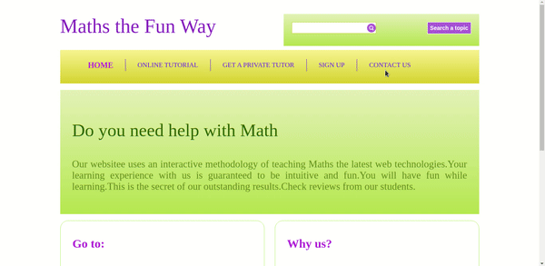
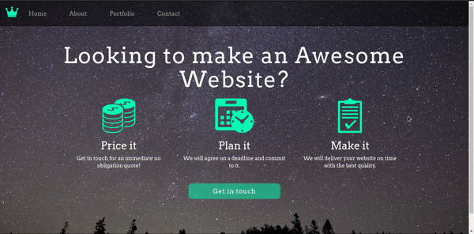
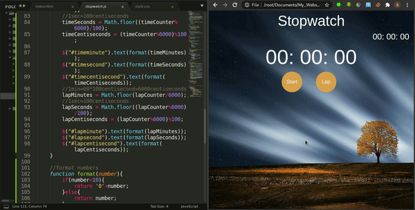
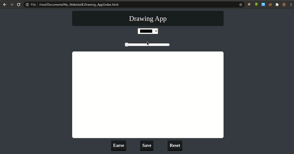

### 1.Math Website (HTML,CSS)
- 

### 2.Math Game (HTML,CSS,JAVASCRIPT)
- 

### 3.Fruits Slice Game (HTML,CSS,JQUERY)
- 

### 4.App Landing Page (HTML,CSS,BOOTSTRAP)
- Responsive Web Page
- 

### 5.Company Website (HTML,CSS,BOOTSTRAP)
- Responsive Web Page
- 

### 6.Our Lovely Course (HTML,CSS,BOOTSTRAP,JQUERY)
- Responsive Web Page
- 

### 7.Stop Watch (HTML,CSS,JQUERY)
- Responsive Web Page
- 

### 8.Drawing App (HTML,CSS,JQUERY UI,Canvas)
- 
